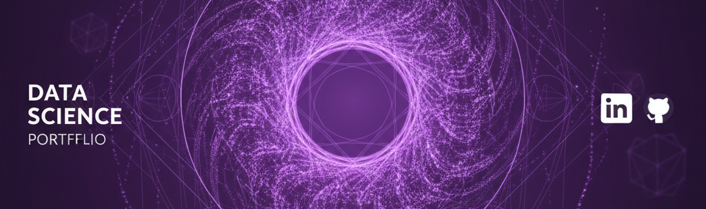

# Eduardo Cornelsen's Applied Data Science Portfolio

 

## About Me
I am a **Business Management** graduate and aspiring Data Scientist specializing in **data-driven process optimization** and **business value creation**. Leveraging a background in **SaaS Sales (ERP/CRM)** and **Entrepreneurship**, I understand the full lifecycle of a business problem—from lead generation to sustained efficiency (validated by my **Lean Six Sigma Green Belt** certification). I am passionate about translating raw data into impactful business strategies.

- 🔭 I’m currently developing a **Time Series Forecasting model** to optimize inventory levels, applying my **Lean Six Sigma** methodology to the project scope.
- 🌱 **Upskilling** in Data Science, Machine Learning, and Cloud Fundamentals via **TripleTen's bootcamp** (Graduating [Month, Year]).
- 👯 Seeking collaborations at the intersection of **Finance (Fintech)**, **SaaS Revenue Operations (RevOps)**, and **AI for Social Impact**.
- 🔗 Connect with me on [Your LinkedIn URL] or email me at [edu@torusagency.com.br](mailto:edu@torusagency.com.br)

## 🛠️ Skills & Toolbelt
Here are some of the technologies I work with:

<table>
  <tr>
    <td align="center" width="96">
      
        Python
    </td>
    <td align="center" width="96">
      
        SQL
    </td>
    <td align="center" width="96">
      
        AWS
    </td>
    <td align="center" width="96">
      
        Docker
    </td>
    <td align="center" width="96">
      
        Scikit-learn
    </td>
    <td align="center" width="96">
      
        TensorFlow
    </td>
    <td align="center" width="96">
      
        Tableau
    </td>
  </tr>
</table>

### **Core Data Science & ML**

 

### **Databases & Big Data**

### **Cloud & MLOps**

 

### **BI & Visualization**

 

### **Development Workflow**

### **Certifications & Methodologies** 🏆

 

### **Other Technologies & Tools**

* **Web/CMS:** HTML, CSS, TypeScript, WordPress, Elementor, Shopify, GitHub Pages
* **Databases:** MongoDB, Supabase
* **Data Engineering/Automation:** Apache Kafka, N8N
* **AI Platforms:** Google Gemini, Ollama, Perplexity, Hugging Face
* **Cloud Services:** Amazon S3, Amazon EC2, Render
* **Marketing Analytics:** Google Analytics, Google Ads, Google Tag Manager, Meta Ads, SEMrush, Qualtrics, HubSpot, Salesforce, Microsoft Advertising
* **Design:** Adobe CC, Figma, Canva, Framer
* **Productivity:** Excel, Google Sheets, PowerPoint, Word, Notion, Discord, Slack, Trello
* **Other:** Markdown, JSON, Windows Terminal

 

## 📊 GitHub Stats

 

 

 

 

 

## 📌 Pinned Projects

## 📝 Recent Blog Posts

## Contact Information
If you have any questions, feedback, or collaboration opportunities, please feel free to reach out to me. You can contact me via email at eduardo.cornelsen@gmail.com edu@torusagency.com.br or connect with me on LinkedIn at Tushar Aggarwal.

Thank you for visiting my Data Analysis Portfolio! I hope you find my projects informative and insightful.

